In this post I will go over an approach to getting developers familiar with LLMs, and how to write code against them. The aim is to get developers comfortable interacting and programming with LLMs. It is only a starting point; it's not meant to be in depth in any way, nor will it cover the inner workings of LLMs or how to make your own. 

As with any field, there are nuances in many of the concepts involved, but those will conveniently be hand-waved away for the sake of getting started.  

For this tutorial you will need access to a commercial off-the-shelf LLM service, such as [OpenAI Playground](https://platform.openai.com/playground), [Azure OpenAI](https://oai.azure.com/portal/), or [Amazon Bedrock](https://us-east-1.console.aws.amazon.com/bedrock/home?region=us-east-1#/text-playground/amazon.titan-text-express-v1); in my examples I will be referencing OpenAI's playground but the others will have similar functionality to follow along. 

You'll also need a Python notebook, which can be a service like [Google Colab](https://colab.research.google.com), [Paperspace Gradient](https://www.paperspace.com/), or [locally in VSCode](https://code.visualstudio.com/docs/datascience/jupyter-notebooks). 

I'll first start with some direct LLM interactions, as these help to provide a base understanding of what's happening behind the scenes. From there we'll build up to the actual programmatic interaction in Python. 


## Clarifying some terms

It helps to be familiar with some of the words that are used in this area. Some are pure marketing, and some have specific meanings. 

**AI** is supposed to be the branch of computer science aiming to enable machines to perform intelligent tasks. It has now been coopted by mainstream media and is additonally employed as a marketing buzzword. It is used to describe any sufficiently advanced technology that wows people, which they don't understand. As an example, text to speech conversion (dictation) was referred to as AI when it first came out decades ago, but is now a commonplace aspect of many application interfaces.  

**Machine Learning** is a subset of AI (the field) that focuses on the development of algorithms and models to enable the performance of specific tasks, like predicting the weather, or identifying a dog breed from a photograph. It is a well established and mature field.

**Large Language Models**, or LLMs, are a specific type of model that have been trained on a large amount of text data, to understand and generate natural language as an output. LLMs have been gaining a lot of media and business attention in the past few years. Well known LLMs are GPT by OpenAI, Claude by Anthropic, and LLaMa by Meta. 

**Image generation models**, are also gaining attention, these can generate an image based on a text description, in various styles and degrees of realism. The most well known systems here are Dall-E, MidJourney and Stable Diffusion. 

In the same vein, there are models for music generation, video generation, and speech. The collective term for these content creation models is **Generative AI**, often shortened to GenAI. 

Of the many types, LLMs get a lot of attention from businesses, research, and hobbyists, because they are very easy to work with. It's simply text input and output, and there are a lot of techniques emerging to optimize working with them. 


## Text completion and temperature

In the LLM playground, switch to the completions tab. Completions is as close as it gets to the raw interface of an LLM, it only needs some text and some additional parameters. 

Give it any sentence fragment to begin with, like

    Once upon a time, 

and let it generate text. It might appear a little nonsensical, but the LLM simply produces what it thinks should come next after the given fragment. 

Try a few more fragments, which can be quite revealing. 

    The following is a C# function to reverse a string:

See how it produces the C# function asked for, but carries on producing output (such as how to use the function, or the same function in other languages), until it reaches the maximum length. The takeaway here is that an LLM is not a chatbot out of the box. Think of an LLM as a very good autocomplete tool, for some given input text it has a decent idea of what should come next. It's up to us to shape the LLM to get it to produce *useful* output. 


Try adjusting the temperature slider now, and see how it affects the output.  Try the following prompt at temperature = 0 and then at temperature = 1. 

    The sky is blue, and 
 
**Temperature** influences the randomness of the model's output; at higher temperatures the generated text is more creative, and at lower temperatures it's more focused. When programming against LLMs, using low temperatures is better if a more deterministic, repeatable output is needed.  







### Tokens and context

**Tokens** are mentioned frequently in LLM interfaces, conversations, as well as pricing.  

Tokens are the units of text that the models understand. They are sometimes full words, and sometimes parts of words or punctuation. The best way to see for yourself is to try the [OpenAI Tokenizer](https://platform.openai.com/tokenizer) and trye the example. 


Notice that some words get split up, some characters that often appear together are grouped up, and some punctuation marks get their own token. There is no exact conversion between tokens and words but the most common idea is to consider on average 4 to 5 characters as be a token.  

LLMs come with a maximum **token context** or context window. Think of it as the number of tokens that the LLM can deal with while still (kind of) being effective at its predictions. The token context includes the input prompt, the output from the model, and any other role-setting or historic text that has been included. LLMs come with a limited token context depending on the model. 


Some well known LLMs and their limits: 

* GPT 3.5: 16k tokens
* GPT 4: 32k tokens
* GPT 4 Turbo: 128k tokens
* Claude v2: 100k tokens
* LLaMa2: 4k tokens

It's tempting to think that the 100k+ LLMs are the best for being able to handle so much at once, but it's not a numbers game. In practice, LLMs start to lose attention when it has to deal with too much input, it 'forgets' what the important parts of the initial input were, and results in poor or distracted output. 

## Chatbots are just completion with stop sequences

While still in the Text Completion playground, switch to another model such as `davinci-002`. Since it isn't made for Q&A type tasks, it is better for illustrating the next concept. 

Begin with a conversational type input like this:

```
Alice: Hi how are you?
Assistant:  
```

and hit generate. In many cases, the text completion produces an output for the Assistant, but carries on the conversation for Alice as well. This is the same principle as before, essentially, producing what a chat transcript could look like between these two characters. 

Now add a **Stop sequence** to the parameters in the completion interface. Add `Alice:` then repeat the above exercise. After each response it will stop instead of producing the next `Alice:`. Carry on the conversation by having Alice ask another question, and then end each new input with `Assistant:`, to let the assistant fill its part in. 

```
Alice: Is everything alright with my account?
Assistant: 
```


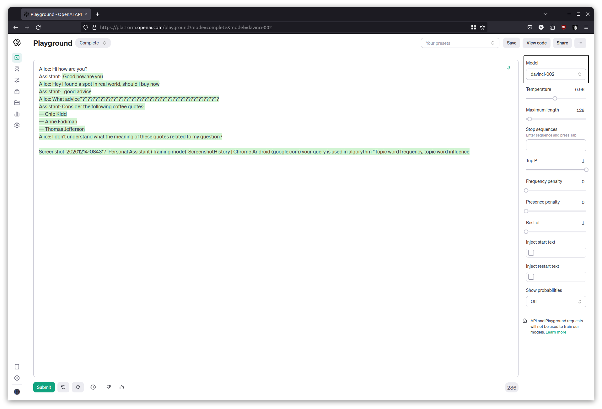
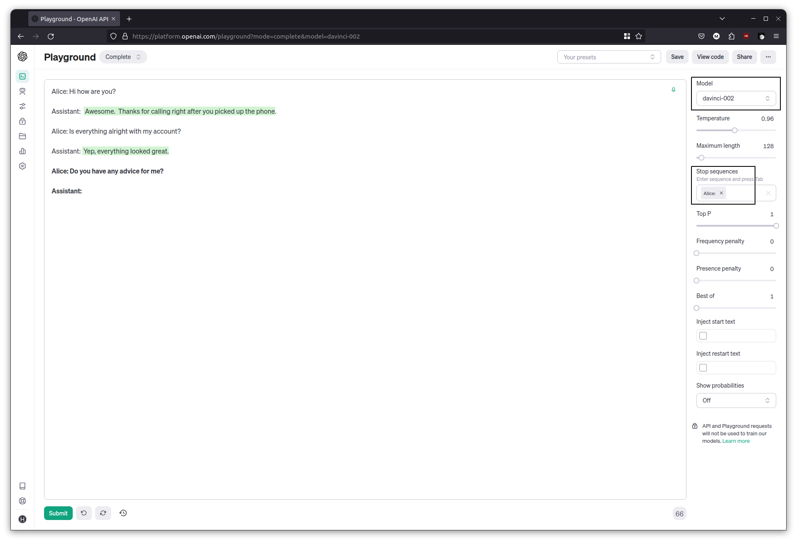


That's a rudimentary chatbot. Each time we hit generate, the previous conversations (the history) are being sent, along with the latest input. The model produces an output until it hits the stop sequence.



OpenAI's Playground as well as Amazon Bedrock's interface make this exercise a bit difficult by seemingly forcing the stop sequence tokens rather than letting the model continue producing output. 



## Using a chat interface

Switch to the Chat playground. From what we've learned so far, it should now be a little more obvious how the chat based interface is working behind the scenes. The chat interface is the one most people will be familiar with, through the well known examples of ChatGPT and Claude. It is also the interface that most LLM programming is written for, as it is tuned for Q&A type work. 

### Chat with history

Try a simple exercise. Ask it for a joke, and then ask for an explanation. 

```
Tell me a joke
```

```
Explain please?
```

The chat interface retains history, so the previous question and answer are included in the input when the explanation was requested. This history retaining feature is a useful and natural part of chatbots, but do keep in mind that it uses up some of the context window.  

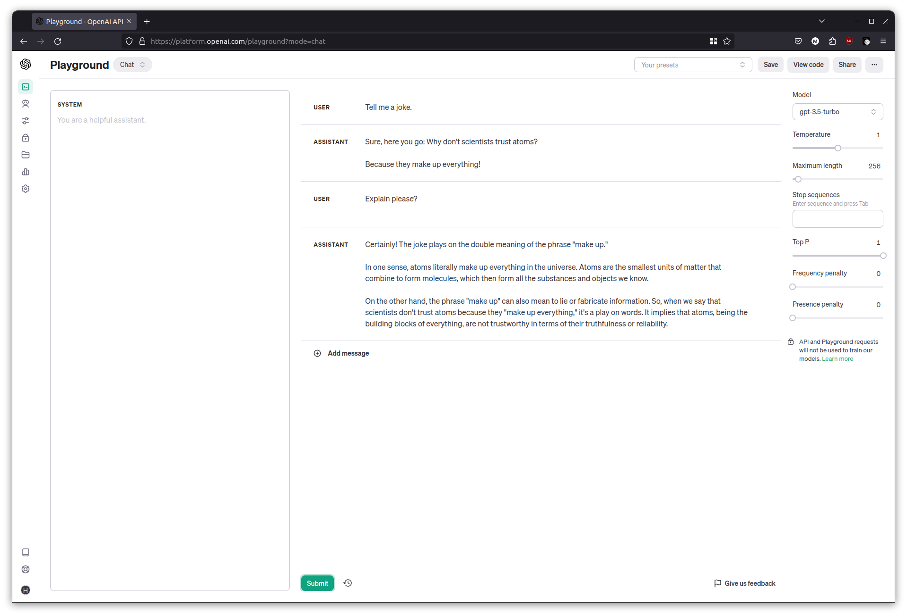

### Summarizing news

A common task with LLMs is to ask it to summarize something. Grab a news article from anywhere, and copy its contents. Ask the chatbot to summarize the news article. The models are pretty good at sifting through irrelevant bits in between too. 

```
Summarize the following news article:

<paste the news article here>
```

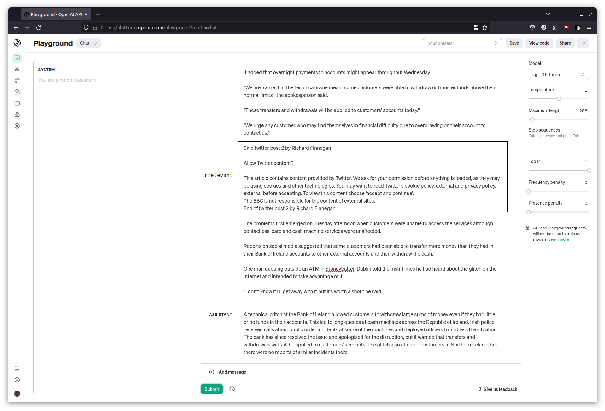

### Answering questions

You can also ask the LLM to answer a question for a given text. Grab the contents of [this article about an asteroid](https://www.universetoday.com/164299/an-asteroid-will-occult-betelgeuse-on-december-12th/), and ask it a question about where the best locations would be to view it. 

```
Given the following news article, answer the question that follows. 

Article: <paste the news article here>

Question: What are the best locations to see the asteroid?
```

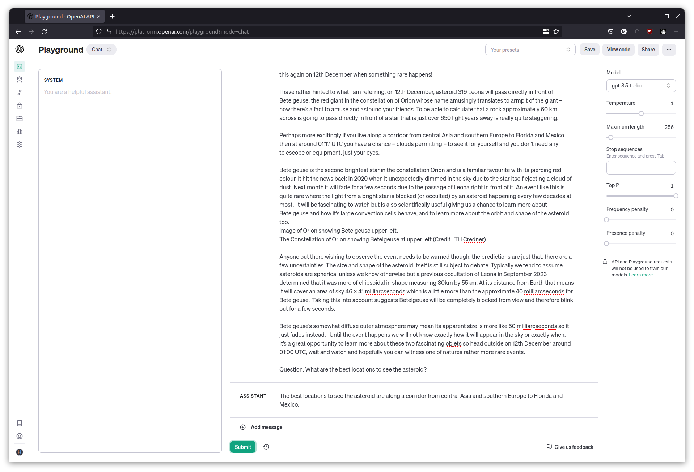


## Context and reasoning with a chatbot

Remember that chatbots work with a context, and based on the additional hints and information that it is given, it can generate text to fit that scenario. 

Try the following input with the chat interface. 

```
Complete the sentence. She saw the bat ___
```

The output I got was alluding to the mammal: `flying through the night sky.`

Clear the chat then try this. 

```
Complete the sentence. She went to the game and saw the bat  ___
```

This gave me a completion about a bat of the wooden variety: `She went to the game and saw the bat hitting home runs.`

The ability to understand an input and respond, with some given context, makes LLMs appear as though they can be used for reasoning. This is considered an emergent property of its language skills, and at times, it is able to do a decent job. 

You can ask the chat interface to emulate reasoning by adding a "Let's think step by step" at the end of a question. 

```
Who is regarded as the greatest physicist of all time, and what is the square root of their year or birth? Let's think step by step.
``` 

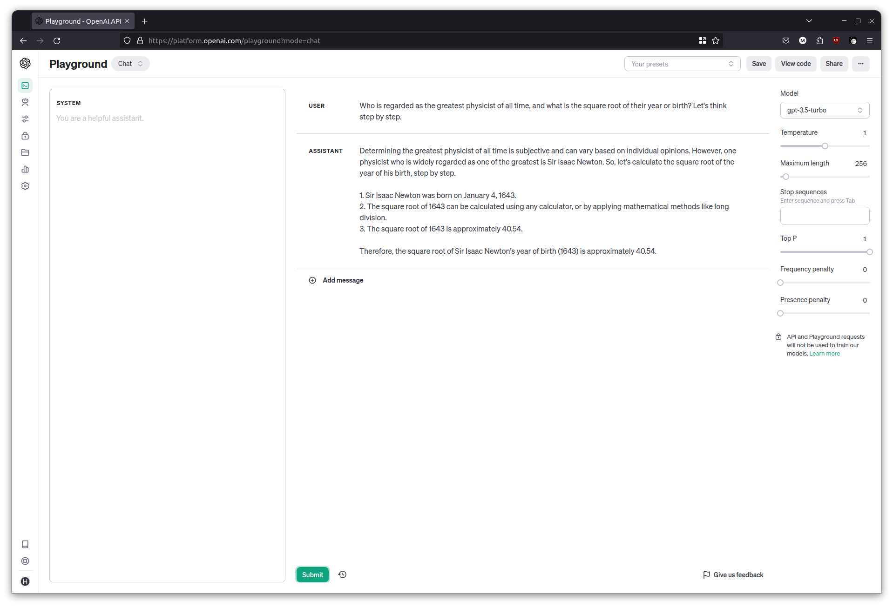

This doesn't always work well though. With the following example from [LLMBenchmarks](https://benchmarks.llmonitor.com/),

```
Sally (a girl) has 3 brothers. Each brother has 2 sisters. How many sisters does Sally have? Let's think step by step.
```

I was reliably informed that Sally had six sisters. 

As amusing as the answer is, it's a contrived example of the dangers that LLMs come with. It has produced a reasonable looking passage of text that *seems* to answer the question, but it can be wrong, and it's really on us to verify it. 

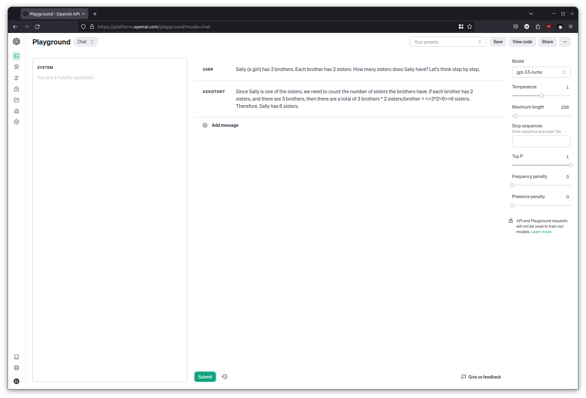


## Shaping the response

So far I've only been showing basic interaction with LLMs. For programmatic interactions, it's important to get the LLM to produce an output that can be worked with in code. It is most common to ask it to output a single word, or something structured like JSON or XML.

Let's make the chatbot help with chemistry related questions. We want it to tell us the atomic number of a given element that the user mentions. 

Clear the chat and set the temperature to 0. Start by asking it to produce only the atomic number, and then follow up with some more element names. 

```
What is the atomic number of Oxygen? Respond only with the atomic number.
```

```
What about Nitrogen?
```

```
Tell me about Helium
```

The LLM can get distracted quite easily and go back to its chatty mode, which isn't great for programmatic interaction. 

### System Messages

A good way to deal with this is to give it a 'role' to play, known as the **system message**. This message gets added right at the beginning of the input to the LLM, which sets the context for the rest of the conversation. 

Clear the chat messages, then in the System prompt area, add the following:

```
You are a helpful assistant with a vast knowledge of chemistry. When the user asks about an element, respond with only the atomic number of the element. Do not include additional information.
```

Try the same questions as before, and the responses should be more consistent this time.  


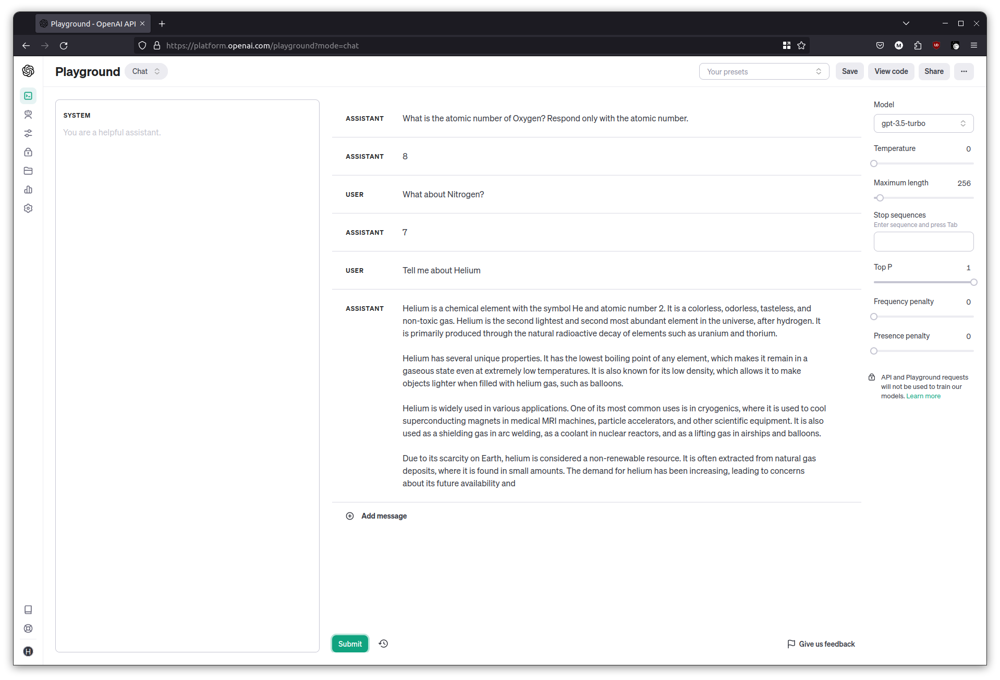
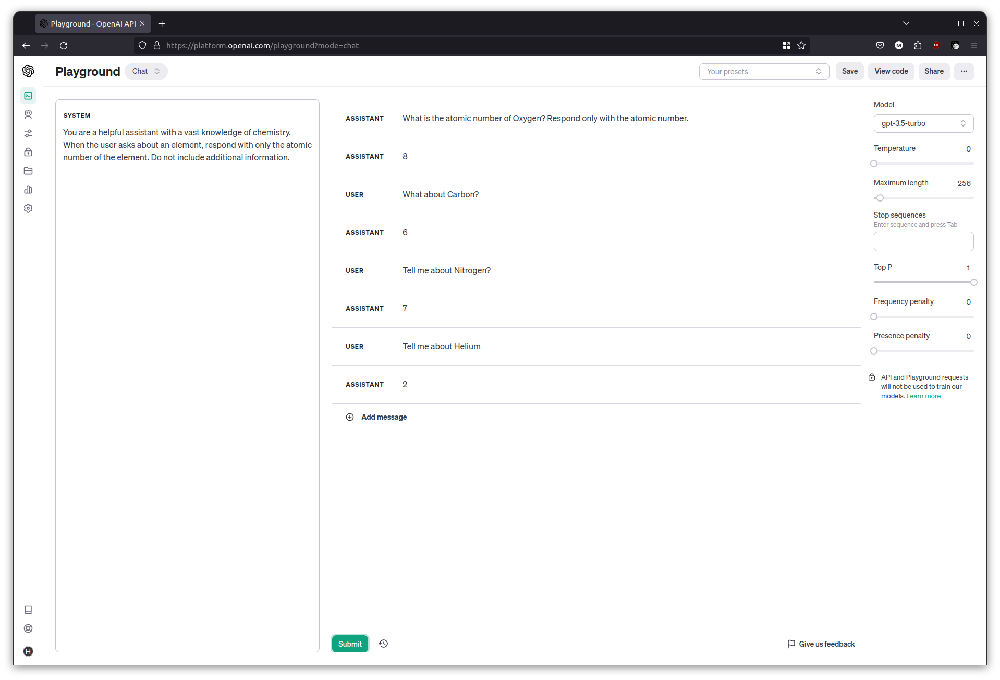


### Giving the LLM examples to learn from

This time, we'd like the chat interface to produce JSON output so that it's easier to work with in our code. Start by modifying the system message and simply asking for some JSON. 

Clear the chat, then in the System prompt area:

```
You are a helpful assistant with a vast knowledge of chemistry. When the user asks about an element, respond with the chemical symbol, atomic number and atomic weight in a JSON format. Do not include additional information.
```

Try asking about some elements and it should respond with some JSON, I got an output like `{"symbol": "V", "atomic_number": 23,  "atomic_weight": 50.9415 }`

Although the LLM made up the JSON key names, there's no guarantee it will always use those key names. We want to control the JSON key names and have the LLM follow our schema. 

This is where examples come in. In the System prompt area, it's possible to provide a few examples to get the LLM going, and then any subsequent answers it produces should follow those examples. This technique is known as **Few Shot Prompting**. 

Clear the chat, then in the System prompt area:

```
You are a helpful assistant with a vast knowledge of chemistry. When the user asks about an element, respond with the chemical symbol, atomic number and atomic weight in a JSON format. Do not include additional information.

Examples:

User: Tell me about Helium. 
Assistant: {"sym": "He", "num": 2, "wgt": 4.0026}

User: What about Nitrogen?
Assistant: {"sym": "N", "num": 7, "wgt": 14.0067}
```

Try the questions once more and observe as the JSON keys match the examples. 


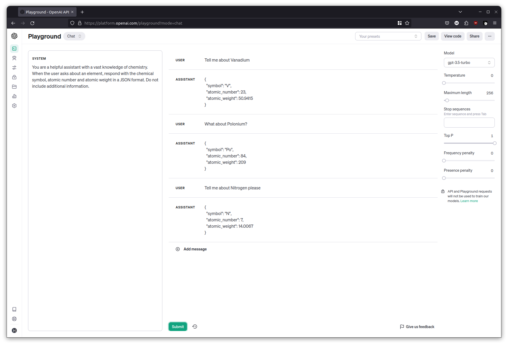
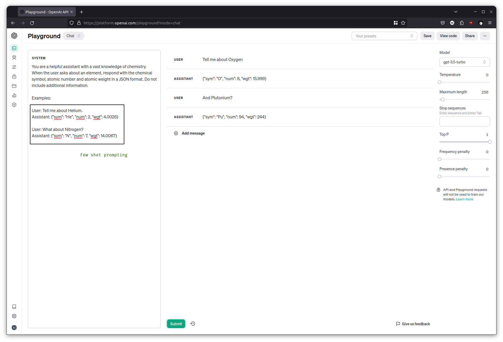



## Programming with Langchain

Langchain is a framework that helps take away the heavy lifting when programming against LLMs including OpenAI, Bedrock and LLaMa. It's useful for prototyping and learning because it takes away a lot of the boilerplate work that we'd normally do, it comes with some predefined templates, and the ability to 'use' tools. The general consensus, currently, is that it's a great way to start, although for an actual production application a developer might want more control over the interaction, and end up doing it themselves. Either way, it's a good place to start for a tutorial at least. 

Once your Python notebook ready, install langchain and openai in a cell. 

```python
! pip install langchain openai
```

Initialize an `llm` object, this will be used by all the modules going forward. Have an API key ready, which can be generated [here for OpenAI](https://platform.openai.com/api-keys). In Azure OpenAI, it is visible by clicking 'View Code'.  

```python
from langchain.chat_models import ChatOpenAI
llm = ChatOpenAI(temperature=1, model="gpt-3.5-turbo", openai_api_key="xxxxxxxxxxxxxxxxx")
```

Here I'm telling it to use the GPT 3.5 Turbo model, with a temperature of 1. 

### Basic completion

Perform a basic completion now, just as we did back in the Completion playground, but this time it's through the `llm` object. Run the code a few times to get different outputs. 

```python
llm.predict("The sky is")
#  
# Output: 
# 'The sky is the atmosphere above the Earth's surface. It is typically blue during the day due to sunlight scattering off particles in the atmosphere. At night, the sky appears black and is filled with stars, planets, and other celestial objects. The sky can also change colors, such as during sunrise and sunset when it can also appear orange, pink, or purple.'
# 'blue.'
# 'blue during the day and black during the night.'
```


### Summarizing text

Set the temperature to 0.1 for the `llm` object, as we need increased predictability for the rest of the exercises. 

```python
from langchain.chat_models import ChatOpenAI
llm = ChatOpenAI(temperature=0.1, model="gpt-3.5-turbo", openai_api_key="xxxxxxxxxxxxxxxxx")
```

In another cell, copy the body text from a news article, and have the LLM summarize it. 

```python
text = """
Summarize the following news article in one paragraph. 

<paste the news article here>
"""

llm.predict(text)

#
# I used the body from https://www.airseychelles.com/en/about-us/news/2021/07/air-seychelles-welcomes-appointment-new-acting-ceo-and-cfo
# Output:
# Air Seychelles has appointed Sandy Benoiton as its permanent chief executive after he served in the role on an interim basis. Benoiton has been with Air Seychelles for over 23 years, primarily as the airline's chief operations officer. The company recently announced profits of $8.4 million for 2022, marking its first positive annual result since 2016. As part of its recovery process, the airline entered administration and significantly reduced its debt levels. Air Seychelles operates a fleet of two Airbus A320 and five De Havilland Canada Dash 6 aircraft.
```

### Answering questions

As before, but programmatically. Supply a news article and a question for the LLM to answer. Grab a [news article](https://www.universetoday.com/164299/an-asteroid-will-occult-betelgeuse-on-december-12th/) and ask a question. 

```python
text = """
Given this news article answer the question that follows.

<paste the news article here>

---

Question: What are the best locations to see the asteroid?"""

llm.predict(text)

# Output:
# The best locations to see the asteroid are along a corridor from central Asia and southern Europe to Florida and Mexico.
```

## Rudimentary chat interface

Recall the main attributes of a chatbot, mainly that it stops after an answer, and that it has some history so it knows what's been asked before. 

On its own, the basic `llm` object declared above is only useful for completion. To illustrate this, run the following in a cell, which creates an inline textbox. 

Give it a statement (`My favourite colour is green`), then a follow up question (`What is my favourite colour?`), and watch it fail. 

```python
chat = ""
while(True):
  if chat=="exit":
    break
  chat=input()
  print(llm.predict(chat))

#
# My favorite colour is green.
# That's great! Green is a vibrant and refreshing color often associated with nature, growth, and harmony. It can also symbolize balance and renewal. What do you like most about the color green?
# What is my favorite colour?
# I'm sorry, but as an AI, I don't have access to personal information about individuals unless it has been shared with me during our conversation. Therefore, I don't know what your favorite color is.  
```


In order to give the LLM memory, we need to supply the previous questions and answers to the LLM as an input, followed by the user's next question. We could build this up ourselves, but Langchain comes with built in helpers to do this for us. 

Declare a Conversation Chain which is Langchain's wrapper class to help with user chats, which takes care of storing and sending previous conversations. With it, add an in-memory conversation buffer. As the name says, it automatically keeps the history in-memory. There are many other options for backing stores for history, the memory one is the simplest for a tutorial. 

```python
from langchain.chains import ConversationChain
from langchain.memory import ConversationBufferMemory
conversation = ConversationChain(llm=llm, memory=ConversationBufferMemory(), verbose=True)
```

Before running it though, have a look at the prompt template to see what it's doing behind the scenes. 

```python
print(conversation.prompt.template)
```

The template looks like this:

```
The following is a friendly conversation between a human and an AI. The AI is talkative and provides lots of specific details from its context. If the AI does not know the answer to a question, it truthfully says it does not know.

Current conversation:
{history}
Human: {input}
AI:
```

The `{input}` is where the user's input goes, and the `{history}` is where the ConversationChain puts the previous conversation. 

To see it in action, send a few questions using the conversation chain. Because we've set verbose=True above, we should also see the template being filled. 

```python
print(conversation.run("My favorite color is green"))
print(conversation.run("What is my favorite color?"))
```

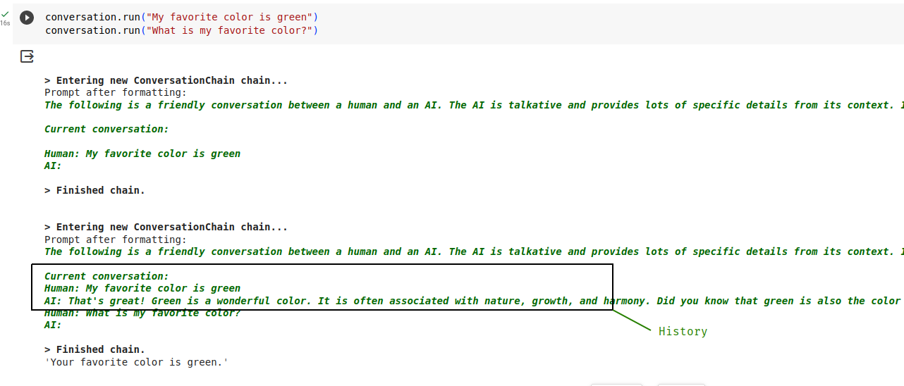

You can now try the same 'inline' chatbot as before, but using the wrapper class with a memory buffer. 

```python
conversation = ConversationChain(llm=llm, memory=ConversationBufferMemory(), )
loop=True
chat=""
while(loop):
  if chat=="exit":
    break
  else:
    chat=input()
    print(conversation.run(chat))

```

Run it, and have a conversation with the LLM! Ask it follow up questions to ensure that the history is being passed, and it's paying attention to previous statements.

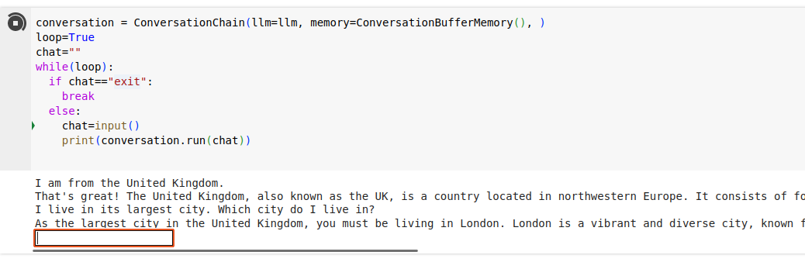

You have now built a rudimentary chatbot. 

## Providing tools to the LLM

If we were to ask the LLM to summarize the contents of the news article at a URL, without giving it the actual contents, it could still generate a summary by guessing from the URL's words. LLMs on their own don't have the ability to crawl web pages. This is where tools come in; we can let the LLM know what our own code has the ability to fetch web pages, all the LLM has to do is invoke it if needed. 

In this exercise we'll create a Langchain Tool that can fetch a web page and return its contents. We'll pass that tool to the LLM, then ask it to summarize the contents of a URL. 

To begin, install the BeautifulSoup4 library which will be used to parse HTML content. 

```python
! pip install beautifulsoup4
```

Define a normal Python function that will crawl a given URL and fetch its contents. 

```python
import requests
from bs4 import BeautifulSoup

def get_content_from_url(url):
  headers={'User-Agent': 'Mozilla/5.0 (X11; Linux x86_64; rv:10.0) Gecko/20100101 Firefox/10.0'}
  response = requests.get(url, headers=headers)
  soup = BeautifulSoup(response.text, "html.parser")
  return soup.find('body').text

```

Do a quick test to make sure it's working, by fetching a URL

```python
print(get_content_from_url('https://www.universetoday.com/164299/an-asteroid-will-occult-betelgeuse-on-december-12th/'))
```

We now create a Langchain `Tool` wrapper and give it a description. This will help the LLM understand what the tool can do. 

```python
from langchain.tools import Tool
fetch_tool = Tool(name="get_content_from_page",
                  func=get_content_from_url, coroutine=get_content_from_url,
                  description="Useful for when you need to get the contents of a web page")
```

Finally, initialize a Langchain Agent, passing it the Tool defined above. 

```python
from langchain.agents import AgentType, initialize_agent
agent = initialize_agent(
    [fetch_tool], llm, agent=AgentType.ZERO_SHOT_REACT_DESCRIPTION, verbose=True, handle_parsing_errors=True
)
```

This creates a Langchain Agent, another useful wrapper in the framework. An 'Agent', in LLM terms, is a fancy way of saying that it has the ability to make use of tools, thereby giving it 'agency'. Technically speaking the LLM does not invoke anything, it simply outputs that it needs to call a certain tool; Langchain takes care of invoking it and returning the result to the LLM so that it can proceed with its reasoning. 

You can have a look at the template being used by Langchain to inform the LLM about the tool. 

```python
agent.to_json()['repr']
```

A bit of squinting at the dense output should show the template, including our suplied `get_content_from_page` tool. 

```
template='Answer the following questions as best you can. You have access to the following tools:

get_content_from_page: Useful for when you need to get the contents of a web page    <------- There!

Use the following format:

Question: the input question you must answer
Thought: you should always think about what to do
Action: the action to take, should be one of [get_content_from_page]
Action Input: the input to the action
Observation: the result of the action
... (this Thought/Action/Action Input/Observation can repeat N times)
Thought: I now know the final answer
Final Answer: the final answer to the original input question

Begin!

Question: {input}
Thought:{agent_scratchpad}'

```

We can now ask the LLM to summarize the contents of a page. 

```python
agent.run("Please fetch and summarize the contents of this page: https://code.mendhak.com/in-appreciation-of-fdroid/")
```

Watch the output as the LLM, in its chain of thought process, figures out it needs to invoke the tool; LangChain picks up on that and does the actual invocation and passes the results back. The LLM then proceeds to summarize the contents. 


Try it with a few more URLs. It is not uncommon for the agent to sometimes fall over and get into a loop (use the stop button next to the cell when this happens). The agent isn't perfect and can get confused at times. 


## Question answering over documents

Although LLMs are trained by crawling over web content, even over trillions of tokens they don't have all the answers. This is especially true for documents or datasets that are specific to businesses and individuals, which the LLM will not have had access to. 

If we want an LLM to answer a question over a specific datset or document store with certainty, we would need to provide those documents to the LLM as part of its context. However, even with 100k+ token LLMs, this isn't feasible if there are lots of documents. The LLM will either lose attention or the large number of documents just won't fit. 

Instead, the answer is to use something called **Retrieval Augmented Generation (RAG)**. We first take all our documents and convert them into embeddings, and store them. When a user asks a question, we match the user's question with the closest set of documents that are probably related to that question. We then grab that document and pass it to the LLM along with the user's question, to get a natural looking answer. The LLM only has to work with relevant documents to answer the question.

In other words, Retrieval Augmented Generation is just a fancy phrasing for picking out most relevant documents before giving it to the LLM. 


If you are rolling your eyes at the numerous bits of pointless, superfluous jargon, and pretentious phrasing for what are basic concepts, you are not alone. Datascience academia appear to have a habit of rewording simple things. Or as I refer to it, semantic recalibration. We'll just have to get used to it. 


Let's briefly look at RAG and embeddings, before doing a basic example in code. 

#### How RAG works

1. We first take each dataset or document, and pass it to an embedding model, which is a way of converting the text into a special numerical representation optimized for natural language searching. 
2. Once we have these embeddings, we store them in a vector store, a database that's optimized for searching over embeddings. 
3. When a user asks a question, we take their question and pass it to the same embedding model. 
4. We use the vector store to search for the documents that most likely match that user's question. This is where embeddings shine as they are good at matching natural language documents together. 
5. Once we have a document matching the user's question, we pass the document and the user's question to the LLM, to generate a natural looking response. 


#### How embeddings work

Embeddings are a special way of representing words, by placing similar terms close to each other. 

A good way to visualize it is with this image below.  

You can have words like "king" and "queen" close to each other in the "male-female" dimension.  
You can have "swam" and "swimming" close to each other in the "verb-tense" dimension.  
You can have "Japan" and "Tokyo" close to each other in the "country-capital" dimension.  

These are just examples of words close to each other, but in just one dimension. 
An embedding is a vector that represents words close to each other across hundreds or *thousands* of dimensions. Embedding models have strong opinions of which kinds of words should be located near each other in such a space. By producing these numerical representations, they make it easy to search for similarity.  

](/assets/images/hands-on-llm-tutorial/023.png)

### Retrieval Augmented Search with Langchain

In a cell, use Langchain's WebBaseLoader to load three URLs. We will eventually ask a question that is answered in one of these pages. 

```python
# Document loading
from langchain.document_loaders import WebBaseLoader

urls = [
    "https://www.cirium.com/thoughtcloud/aviation-analytics-on-the-fly-london-busiest-overseas-airline-markets/",
    "https://www.cirium.com/thoughtcloud/summer-in-spain-airline-market/",
    "https://www.cirium.com/thoughtcloud/analysis-china-slower-post-pandemic-aviation-recovery/",
]
loader = WebBaseLoader(urls)
data = loader.load()
```

All this does so far is fetch the text from these pages. Have a peek inside by running `data` in a cell. 

```python
data
```


### Split up the documents

We now need to split these documents into chunks for embedding and vector storage. I've arbitrarily chosen 500 as the chunk size. 

```python
# Splitting the documents into chunks for embedding and vector storage
from langchain.text_splitter import RecursiveCharacterTextSplitter

text_splitter = RecursiveCharacterTextSplitter(chunk_size = 500, chunk_overlap = 0)
documents = text_splitter.split_documents(data)
```

At this point, `documents` contains the same content from before, just split up, but with references to the original URLs. Have a peek. 

```python
documents[:5]
```

### Set up the embedding model

The document chunks will need to be passed to an embedding model. The text can't just be passed as-is, it needs to be tokenized first. 

Install the tiktoken library. 

```python
! pip install tiktoken
```

Initialize an OpenAIEmbeddings object with the same OpenAI API key. We'll use an OpenAI model called `text-embedding-ada-002` to create embeddings. 

```python
# Initialize Embeddings object to use ADA 002 on OpenAI
from langchain.embeddings import OpenAIEmbeddings
embeddings = OpenAIEmbeddings(openai_api_key="xxxxxxxxxxxxxxxxx", model="text-embedding-ada-002")
```

### What does an embedding actually look like? 

You can do a little test to see what an embedding looks like. 

```python
test_embedding = embeddings.embed_query("The quick brown fox jumps over the lazy little dogs")
```

Have a look at the contents of `test_embedding`, it's a large array of numbers. 

```python
print(test_embedding)
```

An interesting note, if we look at its length, the value is always the same, no matter what text we passed to the embedding model. In the case of ADA 002 model, the value is 1536, which is the number of dimensions (relationships as discussed earlier) that the model represents its tokens in. 

```python
len(test_embedding)
```


### Convert the documents to embeddings and store them

This step is pretty simple, for once. Using the `documents` built earlier, we use the FAISS library to build an in memory vector store, using the `embeddings` object and calling OpenAI's ADA 002 model. 

Install FAISSp

```python
!pip install faiss-cpu
```

And then run the conversion.

```python
db = FAISS.from_documents(documents, embeddings)
```

### Do the search

At this point, the `db` is queryable, and we can get a preview of what a similarity search would look like. Try asking the question: 

```python
db.similarity_search_with_score("Where did EasyJet cut capacity?")
```


The question `Where did EasyJet cut capacity?` will have been converted to an embedding, and a similarity search performed across the in memory vector store. 

It does manage to find a relevant set of passages with some scores. But keep in mind that its similarity search will only find the most relevant _chunk_ that was stored, not the entire document. 

This is where LangChain comes in with another convenience wrapper. We pass the above vector store, along with the user's question to a `RetrievalQAWithSourcesChain`. Langchain uses the retriever to perform the search (as we've tested briefly above), figures out the relevant documents based on score, passes it to the `llm` along with the question, and returns an answer with the source document. 

```python
# Ask a question and retrieve the most likely document
retriever = db.as_retriever()
chain = RetrievalQAWithSourcesChain.from_chain_type(llm=llm, chain_type="stuff", retriever=retriever, return_source_documents=True, verbose=True)
result = chain({"question": "Where did EasyJet cut capacity?"})
print(result["answer"], "Source: ", result["sources"])
```


The template that Langchain uses to instruct the LLM is simple though verbose. Have a look at it:

```python
chain.combine_documents_chain.llm_chain.prompt.template
```


The only LLM related step here was at the end, where the user's question was answered based off a found document. The actual work happened in the storing and searching of the vector store. 

Because embeddings and vector storage are more cost-effective than working with LLMs, it could become a regular fixture in businesses ecosystems. Postgres is a popular database in many tech stacks, and it has a vector search extension called [pgvector](https://github.com/pgvector/pgvector). Having regular data alongside embeddings in the same transactional database is very attractive for people who want to keep a small maintenance footprint.   

One pitfall however is that the embeddings produced are specific to the embedding model used. In our example, if OpenAI ever removed ADA 002, then the embeddings would need to be performed again for every document. 


## LLMs for personal use

Although this tutorial is mostly centered around OpenAI which is a closed, hosted, commercial LLMs, it's also possible to make use of local LLMs running on your computer. It's entirely offline and private, so the only cost is your own hardware and electricity. Several models have been released, and it's a pretty busy space as there's so much activity. 

Some examples of local LLMs are: LLaMa2, Stable Beluga and Mistral. There are a variety of ways to run them, and the best way to get started is with [oobabooga/text-generation-webui](https://github.com/oobabooga/text-generation-webui). 

You can also run via commandline and Docker with [Ollama](https://ollama.ai/blog/ollama-is-now-available-as-an-official-docker-image) and [Python bindings for llama.cpp](https://github.com/abetlen/llama-cpp-python). I was even able to get [LLaMa2 running on my phone](https://www.youtube.com/watch?v=SVN7ljAnXbI).

Programmatic interaction with LangChain makes use of some of the above projects. It can [talk to a local LLaMa2 model](https://python.langchain.com/docs/integrations/chat/llama2_chat), but it's worth noting that most of LangChain development is centered around OpenAI, so they tend to be slower to fix issues or introduce features for other platforms including LLaMa2 and even Amazon's Bedrock. 

Yet another way to run a local model is with [vllm](https://github.com/vllm-project/vllm), which hosts the model behind an HTTP interface that is very similar to OpenAI's own APIs. That means you can use OpenAI libraries to talk to local models. 

