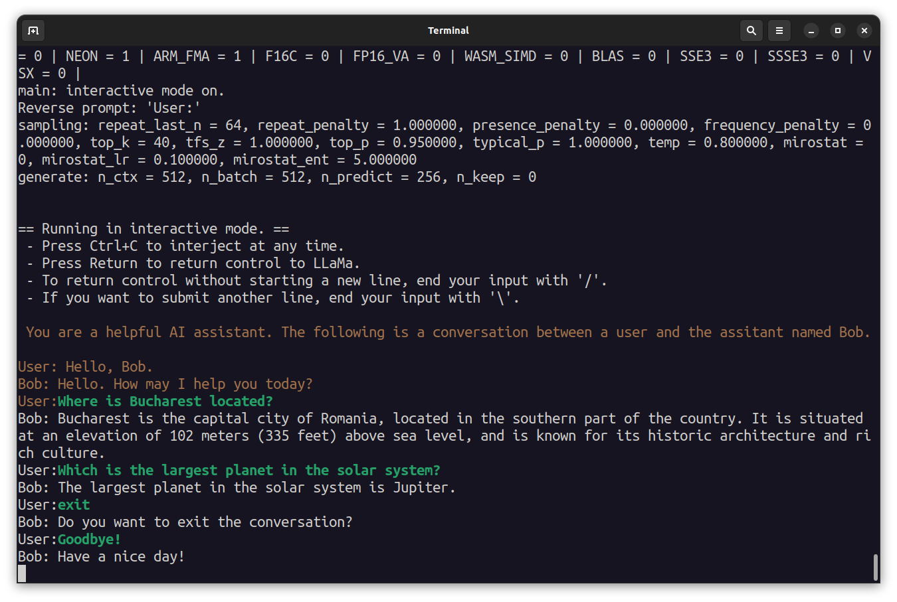

While most well known Large Language Models (LLMs) are closed and behind paywalls, there exist open models such as LLaMa and its derivatives, available for free and private use. A thriving open-source community has built up around them, and projects like MLC and llama.cpp bring these LLMs to consumer devices such as phones and laptops. 

These projects have currently captured my attention; it's pretty fascinating to see an LLM running on low end hardware, and to imagine what possibilities this could open up in the future through this increased accessibility to the masses. 

Here's a video of llama.cpp running on my Pixel 6. Yes, it's a hobbled model made for weaker hardware, and yes the speed isn't great. But still! It's like having a personal, private information retrieval tool. 




I wanted to explore the potential of integrating an LLM into an automation workflow, just to see if it was possible. 

The conclusion is that it is somewhat possible, and in this example I am using it as a daily itinerary generator for the current location I'm in. 







## The Setup

On Android, the most widely-used automation frameworks are Tasker and Automate, both of which can work with Termux commands. This setup is highly practical and straightforward to work with. llama.cpp is a framework to run simplified LLMs, and it can run on Android. Termux is a Linux virtual environment for Android, and that means it can execute Bash scripts.


I'll go over how I set up llama.cpp, the Termux environment to run it, and the Automate app to invoke it.  

## Building llama.cpp

The [llama.cpp README](https://github.com/ggerganov/llama.cpp#android) has pretty thorough instructions. Although its Android section tells you to build llama.cpp on the Android device itself, I found it easier to just build it on my computer and copy it over. Using Android Studio's SDK Tools, install the NDK and CMake. 


You can then follow pretty much the same instructions as the README. Clone the llama.cpp repo, point  `$NDK` at the NDK location, and build it: 

```bash
sudo apt install make cmake
git clone git@github.com:ggerganov/llama.cpp.git
cd llama.cpp

mkdir build-android
cd build-android
export NDK=/home/mendhak/Android/Sdk/ndk/25.2.9519653/
cmake -DCMAKE_TOOLCHAIN_FILE=$NDK/build/cmake/android.toolchain.cmake -DANDROID_ABI=arm64-v8a -DANDROID_PLATFORM=android-23 -DCMAKE_C_FLAGS=-march=armv8.4a+dotprod ..
make
```

This creates a `main` executable in the `build-android/bin` directory. We'll need to copy the executable over to the Android device, specifically into the Termux working space. For that we'll need to set up Termux and SSH. 


## Termux and SSH

Termux is a terminal emulator for Android, think of it as a Linux environment. This is where we'll be running the llama.cpp binary with the LLM. Start by [installing Termux from F-Droid](https://f-droid.org/en/packages/com.termux/) - this isn't a preference, the Google Play Store version has been deprecated. After installing Termux, I ran `pkg upgrade` to ensure the latest packages were available. 

Next is to [set up an SSH server](https://glow.li/posts/run-an-ssh-server-on-your-android-with-termux/) in Termux to allow connecting from your computer. This part is technically optional, but working over SSH is the easiest way to deal with lots of typing; an alternative would be to pair a Bluetooth keyboard with your Android phone but that still requires squinting and hunching. Following the steps, 

```bash
# In Termux:
apt install openssh
passwd  # Change the password
whoami # Make note of the username, For me it was u0_a301
sshd # Start the SSH server on port 8022
```

It's a good idea to test connectivity from the computer, over its default port 8022, entering the password that was set above. This should output a list of files and exit ssh.

```bash
# From computer:
ssh u0_a301@192.168.50.66 -p 8022 ls -lah
```


### Copy the binary over

We can now use `scp` to copy the built binary over. I just copied it over to the home directory. 

```bash
# From computer
scp -P 8022 bin/main u0_a301@192.168.50.66:./
```

## Download a model and run it 

To run `main` we'll need an actual LLM to interact with. LLaMa2 is well known, but I decided to go with a derivative called [StableBeluga](https://stability.ai/blog/stable-beluga-large-instruction-fine-tuned-models). llama.cpp requires models to be in a GGUF format, one for StableBeluga has been made available [here](https://huggingface.co/TheBloke/StableBeluga-7B-GGUF). 

```bash
# From computer
ssh u0_a301@192.168.50.66 -p 8022

# You are now in Termux
# Test the binary
./main -h

# Create a directory to download model files into 
mkdir -p models/7B/

# Install wget
pkg install wget 

# Download the Stable Beluga 7B GGUF model into the directory
wget https://huggingface.co/TheBloke/StableBeluga-7B-GGUF/resolve/main/stablebeluga-7b.Q4_K_M.gguf -P models/7B/
```

It takes a while to download the model, and we can now run our first test. Try some sentence completion. 

```bash
./main --seed -1 --threads 4 --n_predict 30 --model ./models/7B/stablebeluga-7b.Q4_K_M.gguf --top_k 40 --top_p 0.9 --temp 0.7 --repeat_last_n 64 --repeat_penalty 1.3 -p "The fascinating thing about chickens is that " 2>/dev/null
```

You can also try providing a prompt and have an interactive session with the assistant. Ask it some questions, and say Goodbye to exit, or press Ctrl+C. 

```bash
/main -m ./models/7B/stablebeluga-7b.Q4_K_M.gguf -n 256 --repeat_penalty 1.0 --color -i -r "User:" -p "You are a helpful AI assistant named Bob. The following is a conversation between a user and the assistant named Bob. 
User: Hello, Bob.
Bob: Hello. How may I help you today?
User: "
```




## Set up Automate

Automate is an automation framework app for Android; by coincidence it's published by a company called LlamaLab. Automate can interact with Termux in a few different ways but the simplest one is to use a plugin and grab an example workflow and just modify it. 

After [installing Automate](https://play.google.com/store/apps/details?id=com.llamalab.automate&hl=en&gl=US), go to Settings > Privileges, and enable the option `Run commands in Termux environment`. Install the [Tasker plugin for Termux](https://f-droid.org/en/packages/com.termux.tasker/) (Automate can work with Tasker plugins), and download the [sample Run Termux Command With Tasker workflow](https://llamalab.com/automate/community/flows/38833). Automate should handle this link and the downloaded workflow becomes available in its list as `Run Termux Command with Termux:Tasker` 

Go ahead and create a test script as the sample needs, just to ensure it's working. 

Create the script:
```bash
mkdir -p ~/.termux/tasker/
nano ~/.termux/tasker/test.sh
```
With these contents:
```
#!/data/data/com.termux/files/usr/bin/sh
echo $1
```
Then save, and make it executable:
```bash
chmod u+x ~/.termux/tasker/test.sh
```

Finally try running the sample workflow in the Automate app, and after a moment a toast with the number '1000' should appear. The Automate Flow is passing 1000 as an argument to the script which the script faithfully echoes, it's picked up by the plugin and sent back to the Flow, to be shown in a toast. 

## Script to interact with the model

The final piece is to create a script that will call the llama.cpp main binary pointing at the Stable Beluga model, and have Automate call that script in turn. 

Create a bash script at `~/.termux/tasker/qa.sh` with the following content:

```bash
#!/data/data/com.termux/files/usr/bin/sh

the_args="$@"
the_output=$(./main --log-disable --seed -1 --threads 4 --n_predict 30 --model ./models/7B/stablebeluga-7b.Q4_K_M.gguf --top_k 40 --top_p 0.9 --temp 0.1 --repeat_last_n 64 --repeat_penalty 1.3 -p "### System:
You are a knowledgeable AI assistant. Respond to the user's questions with short answers. 

### User:
$the_args

### Assistant:
" 2>/dev/null)
echo ${the_output##*Assistant:}
```

This uses Stable Beluga's prompt template to ask a question, and then extracts everything after the `Assistant:` in the response from the LLM. That is echoed back so that Automate can pick up on it. 

As before, make it executable, and it's worth trying it out to make sure it's working. 

```bash
chmod u+x ~/.termux/tasker/qa.sh

~/.termux/tasker/qa.sh What is the capital of Venezuela?
```

## Automate calls the script

Modify the flow in Automate, instead of passing in 1000, have it pass a hardcoded question, or prompt the user for a question using the Dialog Input block (set the output variable to `myvar`). You can even output the result in a Dialog Message block, have its message set to the variable `so` which is the response sent back from the plugin block, which contains the value echoed by the script. 







### Travel Agent example

A simple tweak can turn the LLM into a travel agent. Create a `~/.termux/tasker/travelagent.sh` with the following contents. Note that `--n_predict`, the number of predicted tokens, is now set to 250, which means it'll take a little longer to produce an output.

```bash
#!/data/data/com.termux/files/usr/bin/sh

the_args="$@"
the_output=$(./main --log-disable --seed -1 --threads 4 --n_predict 250 --model ./models/7B/stablebeluga-7b.Q4_K_M.gguf --top_k 40 --top_p 0.9 --temp 0.1 --repeat_last_n 64 --repeat_penalty 1.3 -p "### System:
You are a helpful travel agent. For the given city, generate a short itinerary.

### User:
$the_args

### Assistant:
" 2>/dev/null)
echo ${the_output##*Assistant:}
```

In Automate, create a new Flow which makes an HTTP request to `https://ipinfo.io/city` (which returns your city based on IP address), passing that as an argument to the script. 






So this flow is: Use my IP address to get my city, then pass the city name to the LLM and ask it to generate a short itinerary. 

## Decision making?

With the pieces in place, it's a matter of modifying the system prompt for the LLM to have it behave as a decision making tool. The key is to shape the output of the model to match an expected structure, and then to get Automate to parse it and 'do something' with it. For example, given a piece of text you can ask the model to produce `positive`, or `negative`. That output used in Automate's if block can act as a branch. 

It's more complicated, but it's conceivable that the LLM could be provided with tools from the specific Automate Flow, and use that to work out a decision itself. Looking at a [library like Langchain](https://python.langchain.com/docs/modules/agents/tools/custom_tools), the prompt could look something like this:

```
Answer the following questions as best you can. You have access to the following tools:

get_content_from_page: Useful for when you need to get the contents of a web page
get_weather_in_location: Useful for when you need to know the weather in a city   
get_current_date: Useful for when you need to know the date and time

Use the following format:

Question: the input question you must answer
Thought: you should always think about what to do
Action: the action to take, should be one of [get_content_from_page, get_content_from_page, get_current_date]
Action Input: the input to the action
Observation: the result of the action\
... (this Thought/Action/Action Input/Observation can repeat N times)
Thought: I now know the final answer
Final Answer: the final answer to the original input question

Begin!

Question: {input}
Thought:{agent_scratchpad}
```

The main trouble here of course would be the tedious parsing required, feeding it into the right tool (branch) in an Automate Flow, and feeding the response back. This could probably be made easier if frameworks are developed around it. Termux [*can* run Python](https://wiki.termux.com/wiki/Python), which means a lightweight framework to interact with LLMs [might be possible](https://github.com/abetlen/llama-cpp-python/issues/389). 

For now the simplest approach is probably to use the LLM to produce a single output and carry on, not bothering with back-and-forth conversations. 

